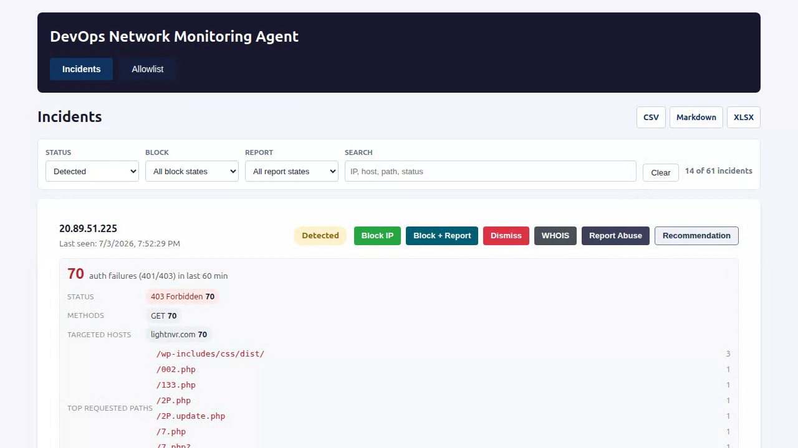

# DevOps Agent

DevOps Agent detects suspicious edge traffic from Elasticsearch logs, opens incidents, helps approve Kubernetes edge blocks, and prepares abuse-report emails with supporting evidence.

The default workflow is local-first: run the SPA on your workstation, port-forward Elasticsearch when needed, review incidents, then explicitly approve blocks and reports.

## Demo

[](demo.webm)

[Watch the demo video](demo.webm)

## Features

- Scheduled detection of repeated authentication failures in Traefik-style access logs.
- SPA review queue with block state, reporting state, filtering, exports, and abuse-report actions.
- Kubernetes enforcement against a configurable Traefik deny route.
- Elasticsearch tunnel discovery for local cluster access.
- Abuse contact enrichment and email delivery through Mailjet or Postmark.
- CSV, Markdown, and XLSX block-list export.

## Secret Handling

No live credentials should be committed. Keep secrets in `.env`, your shell environment, or cluster secrets loaded by `./start.sh --es-tunnel`.

The repository intentionally ignores `.env`, `.env.*`, local/private config profiles, databases, exports, logs, and scanner reports. Use `.env.example` and `config.yaml.example` as templates.

## Quick Start

```bash
cp .env.example .env
cp config.yaml.example config/local.yaml
$EDITOR .env config/local.yaml
./start.sh --config config/local.yaml --serve --es-tunnel
```

Open the SPA URL printed by the startup script. Use `--dry-run` to record approvals without changing the cluster, or `--enforce` to force live block application when the config disables it.

The default config expects a local OpenAI-compatible LLM on `http://127.0.0.1:8080/v1`. To make that explicit or override another profile:

```bash
./start.sh \
  --config config/local.yaml \
  --serve \
  --es-tunnel \
  --llm-provider openai \
  --llm-url http://127.0.0.1:8080/v1 \
  --llm-api-key local
```

## Configuration

`config/default.yaml` is a public-safe baseline. For real environments, create an ignored local profile such as `config/local.yaml` or pass an explicit config path with `--config`.

Common environment variables:

- `ES_USERNAME`, `ES_PASSWORD`, `ES_API_KEY`
- `LLM_API_KEY`, `LLM_MODEL`
- `MAILJET_API_KEY`, `MAILJET_API_SECRET`
- `POSTMARK_SERVER_TOKEN`
- `K8S_CONTEXT`, `K8S_KUBECONFIG`, `K8S_SERVICE_ACCOUNT_TOKEN`

Use `./start.sh --help` for the complete list of runtime flags.

## Development

```bash
cargo test
bash -n start.sh
```

The SPA assets live under `src/web/static`. The Rust server embeds the API and static file server.

## Public Repo Checklist

Before publishing or opening a pull request:

```bash
git status --short
git diff --check
git ls-files -z --cached --others --exclude-standard \
  | xargs -0 rg -n "BEGIN .*PRIVATE|AKIA|ghp_|github_pat_|sk-[A-Za-z0-9]|password|secret|token|api[_-]?key" || true
```

Review any hits manually. Placeholder names in examples are expected; live values are not.
